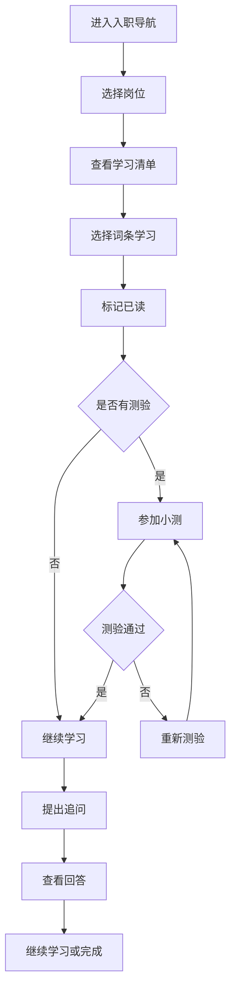
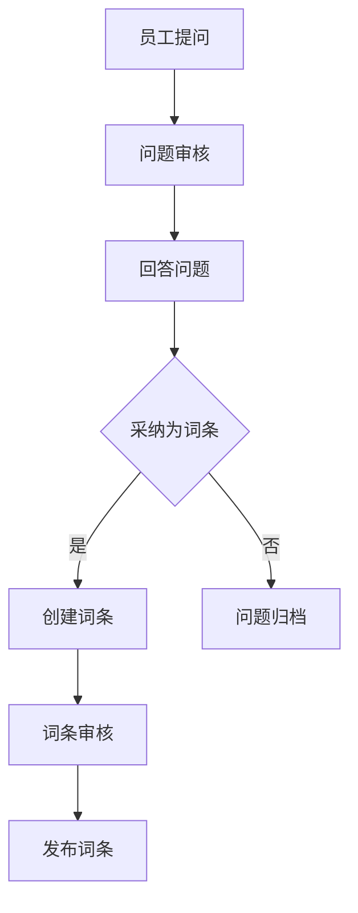

## 1. Product Overview

公司知识百科是一个面向企业内部的知识管理平台，旨在帮助新员工快速入职学习和促进跨部门协作查询。通过系统化的知识组织和互动问答机制，提升员工学习效率和知识沉淀能力。

## 2. Core Features

### 2.1 User Roles
| Role | Registration Method | Core Permissions |
|------|---------------------|------------------|
| 管理员 | 后台配置 | 创建/编辑词条、管理主题路径、审核问答、管理用户 |
| 员工 | 邮箱注册/企业账号 | 浏览知识、标记已读、参加小测、提出追问、查看学习进度 |
| 主管 | 角色升级 | 查看团队完成率、薄弱知识点、待回复问题 |

### 2.2 Feature Module
1. **入职导航页**: 新人引导、岗位学习清单入口、快速开始
2. **知识地图页**: 主题路径展示、分类浏览、搜索功能
3. **问答专区页**: 问题列表、提问、回答、采纳功能
4. **词条详情页**: 词条内容、负责人信息、相关阅读、评论
5. **学习进度页**: 个人学习统计、已读记录、测验成绩、待学清单

### 2.3 Page Details
| Page Name | Module Name | Feature description |
|-----------|-------------|---------------------|
| 入职导航页 | 新人引导 | 欢迎语、岗位选择、学习路径推荐 |
| 入职导航页 | 学习清单 | 按岗位分类的学习内容列表 |
| 知识地图页 | 主题路径 | 可视化知识结构、层级展示 |
| 知识地图页 | 搜索筛选 | 关键词搜索、部门筛选、标签筛选 |
| 问答专区页 | 问题列表 | 问题卡片、状态筛选、排序 |
| 问答专区页 | 问答交互 | 提问表单、回答功能、采纳操作 |
| 词条详情页 | 内容展示 | 词条正文、负责人、适用部门、更新时间 |
| 词条详情页 | 相关阅读 | 关联词条推荐 |
| 学习进度页 | 个人统计 | 完成率、学习时长、测验成绩 |
| 学习进度页 | 团队视图 | 团队完成率、薄弱知识点（主管专属） |

## 3. Core Process

### 3.1 员工学习流程

### 3.2 问答沉淀流程

## 4. User Interface Design

### 4.1 Design Style
- **主色调**: 深蓝色系（#1E3A5F）作为主色，搭配清新绿色（#22C55E）作为强调色
- **按钮风格**: 圆角矩形，hover 状态有阴影变化
- **字体**: 思源黑体作为主要字体，标题加粗
- **布局风格**: 卡片式布局，清晰的信息层级
- **图标风格**: 简洁线条图标

### 4.2 Page Design Overview
| Page Name | Module Name | UI Elements |
|-----------|-------------|-------------|
| 入职导航页 | 欢迎区域 | 大标题、副标题、入职天数提示 |
| 入职导航页 | 岗位选择 | 岗位卡片网格、图标+名称 |
| 知识地图页 | 主题树 | 可展开的层级结构、进度标记 |
| 知识地图页 | 搜索栏 | 顶部搜索框、筛选标签 |
| 问答专区页 | 问题卡片 | 标题、状态标签、提问时间 |
| 问答专区页 | 提问表单 | 标题输入、内容输入、标签选择 |
| 词条详情页 | 信息头部 | 标题、负责人头像、适用部门标签 |
| 词条详情页 | 内容区域 | 富文本内容、相关阅读推荐 |
| 学习进度页 | 统计卡片 | 环形进度图、数字统计 |
| 学习进度页 | 列表区域 | 学习记录、测验成绩表格 |

### 4.3 Responsiveness
- **桌面端**: 完整功能展示，多栏布局
- **平板端**: 自适应布局，减少侧边栏
- **移动端**: 单列布局，底部导航

### 4.4 Accessibility
- 支持键盘导航
- 合理的颜色对比度
- 图片配有 alt 文字
- 语义化 HTML 标签