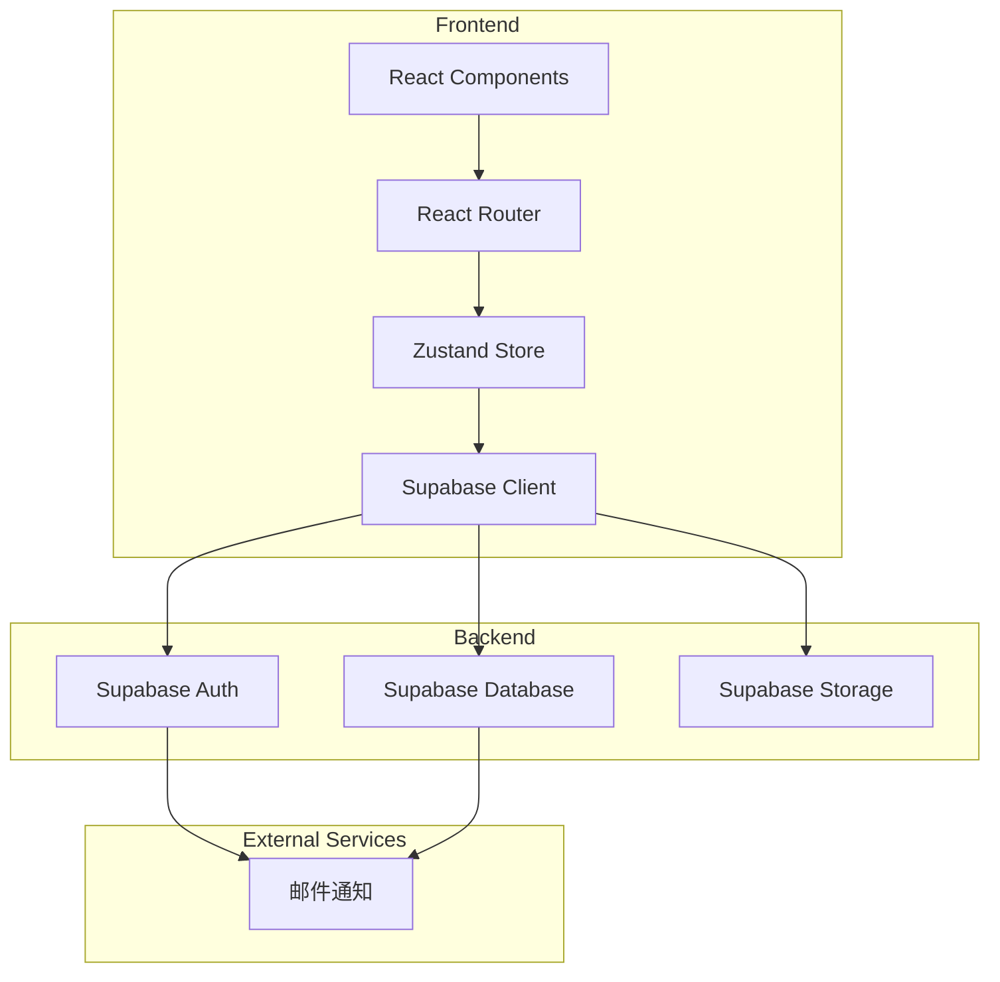
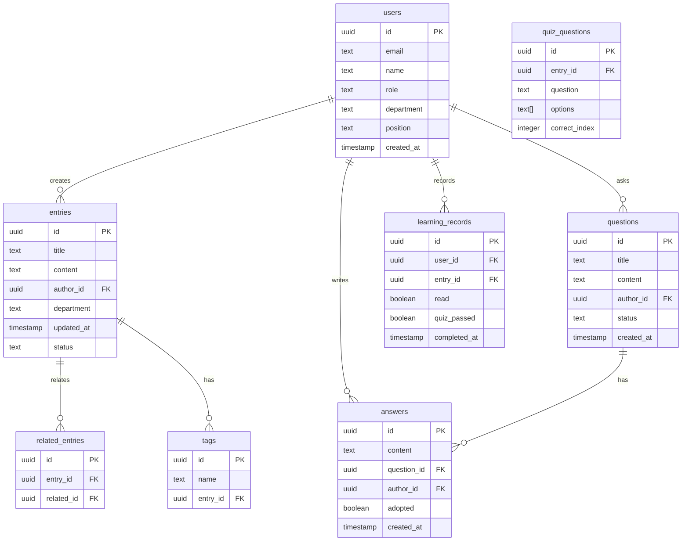

## 1. Architecture Design



## 2. Technology Description
- **Frontend**: React@18 + TypeScript + TailwindCSS@3 + Vite
- **State Management**: Zustand
- **Routing**: React Router DOM
- **Icons**: Lucide React
- **Backend**: Supabase (Authentication, Database, Storage)

## 3. Route Definitions
| Route | Purpose | Component |
|-------|---------|-----------|
| / | 首页/入职导航 | OnboardingPage |
| /knowledge-map | 知识地图 | KnowledgeMapPage |
| /qa | 问答专区 | QAPage |
| /entry/:id | 词条详情 | EntryDetailPage |
| /learning-progress | 学习进度 | LearningProgressPage |
| /admin | 管理后台 | AdminPage |

## 4. API Definitions

### 4.1 Auth API
| Method | Endpoint | Description |
|--------|----------|-------------|
| POST | /auth/signup | 用户注册 |
| POST | /auth/signin | 用户登录 |
| POST | /auth/signout | 用户退出 |
| GET | /auth/user | 获取当前用户 |

### 4.2 Entry API
| Method | Endpoint | Description |
|--------|----------|-------------|
| GET | /entries | 获取词条列表 |
| GET | /entries/:id | 获取词条详情 |
| POST | /entries | 创建词条 |
| PUT | /entries/:id | 更新词条 |
| DELETE | /entries/:id | 删除词条 |

### 4.3 QA API
| Method | Endpoint | Description |
|--------|----------|-------------|
| GET | /questions | 获取问题列表 |
| GET | /questions/:id | 获取问题详情 |
| POST | /questions | 创建问题 |
| POST | /questions/:id/answers | 添加回答 |
| PUT | /questions/:id/adopt | 采纳回答 |

### 4.4 Learning API
| Method | Endpoint | Description |
|--------|----------|-------------|
| GET | /learning/progress | 获取学习进度 |
| POST | /learning/mark-read | 标记已读 |
| POST | /learning/quiz | 提交测验答案 |
| GET | /learning/team | 获取团队进度（主管） |

## 5. Data Model

### 5.1 Entity Relationship Diagram


### 5.2 Data Definition Language

```sql
-- users table
CREATE TABLE users (
    id UUID PRIMARY KEY DEFAULT uuid_generate_v4(),
    email TEXT UNIQUE NOT NULL,
    name TEXT NOT NULL,
    role TEXT DEFAULT 'employee',
    department TEXT,
    position TEXT,
    created_at TIMESTAMP DEFAULT NOW()
);

-- entries table
CREATE TABLE entries (
    id UUID PRIMARY KEY DEFAULT uuid_generate_v4(),
    title TEXT NOT NULL,
    content TEXT NOT NULL,
    author_id UUID REFERENCES users(id),
    department TEXT,
    updated_at TIMESTAMP DEFAULT NOW(),
    status TEXT DEFAULT 'published'
);

-- tags table
CREATE TABLE tags (
    id UUID PRIMARY KEY DEFAULT uuid_generate_v4(),
    name TEXT NOT NULL,
    entry_id UUID REFERENCES entries(id)
);

-- related_entries table
CREATE TABLE related_entries (
    id UUID PRIMARY KEY DEFAULT uuid_generate_v4(),
    entry_id UUID REFERENCES entries(id),
    related_id UUID REFERENCES entries(id)
);

-- questions table
CREATE TABLE questions (
    id UUID PRIMARY KEY DEFAULT uuid_generate_v4(),
    title TEXT NOT NULL,
    content TEXT NOT NULL,
    author_id UUID REFERENCES users(id),
    status TEXT DEFAULT 'pending',
    created_at TIMESTAMP DEFAULT NOW()
);

-- answers table
CREATE TABLE answers (
    id UUID PRIMARY KEY DEFAULT uuid_generate_v4(),
    content TEXT NOT NULL,
    question_id UUID REFERENCES questions(id),
    author_id UUID REFERENCES users(id),
    adopted BOOLEAN DEFAULT FALSE,
    created_at TIMESTAMP DEFAULT NOW()
);

-- learning_records table
CREATE TABLE learning_records (
    id UUID PRIMARY KEY DEFAULT uuid_generate_v4(),
    user_id UUID REFERENCES users(id),
    entry_id UUID REFERENCES entries(id),
    read BOOLEAN DEFAULT FALSE,
    quiz_passed BOOLEAN DEFAULT FALSE,
    completed_at TIMESTAMP
);

-- quiz_questions table
CREATE TABLE quiz_questions (
    id UUID PRIMARY KEY DEFAULT uuid_generate_v4(),
    entry_id UUID REFERENCES entries(id),
    question TEXT NOT NULL,
    options TEXT[] NOT NULL,
    correct_index INTEGER NOT NULL
);

-- indexes
CREATE INDEX idx_entries_department ON entries(department);
CREATE INDEX idx_questions_status ON questions(status);
CREATE INDEX idx_learning_records_user ON learning_records(user_id);
```

## 6. Security

### 6.1 Row Level Security Policies
- **users**: 仅允许管理员查看所有用户，用户只能查看自己的信息
- **entries**: 匿名用户可读取，认证用户可创建，管理员可编辑/删除
- **questions**: 认证用户可创建和读取，管理员可管理
- **answers**: 认证用户可创建和读取，问题作者和管理员可管理
- **learning_records**: 用户只能查看和修改自己的学习记录

### 6.2 Permission Grants
```sql
GRANT SELECT ON users TO anon;
GRANT SELECT, INSERT ON entries TO authenticated;
GRANT SELECT ON questions TO anon;
GRANT SELECT, INSERT ON questions TO authenticated;
GRANT SELECT, INSERT ON answers TO authenticated;
GRANT ALL ON ALL TABLES TO authenticated;
```